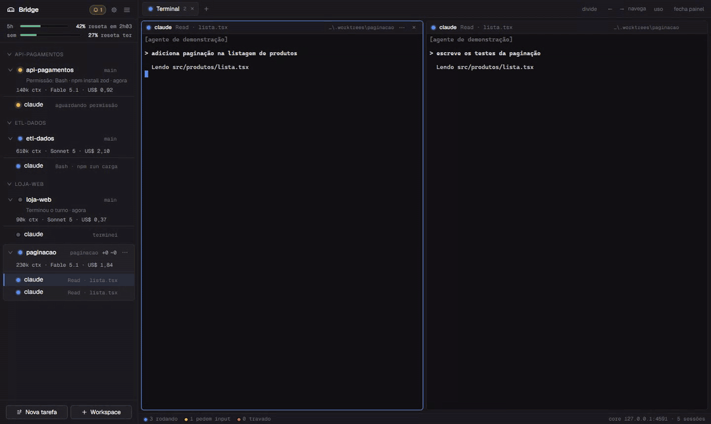
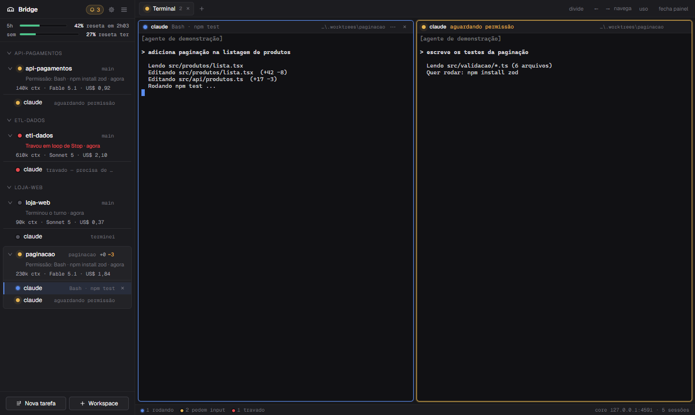
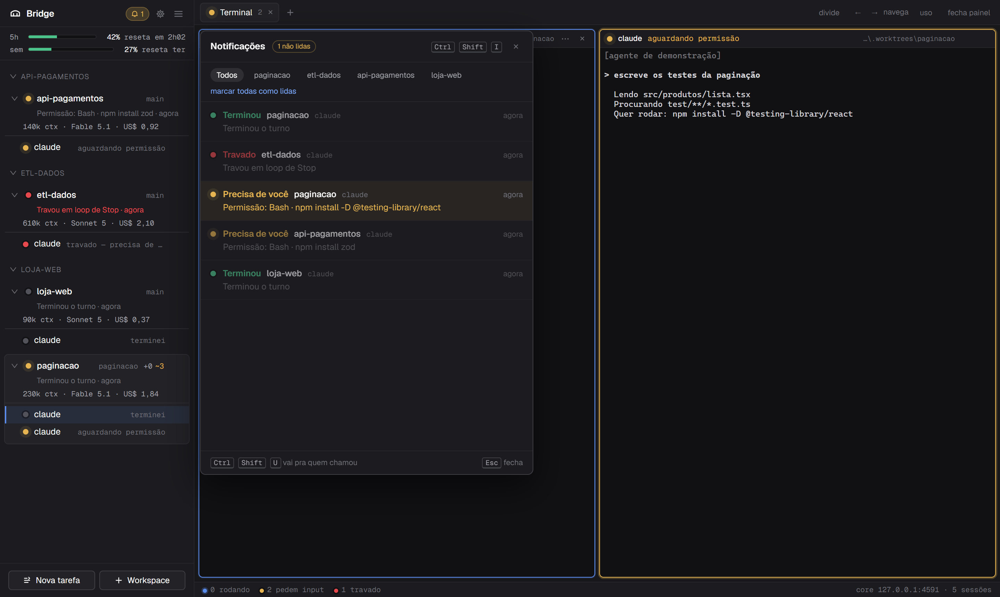
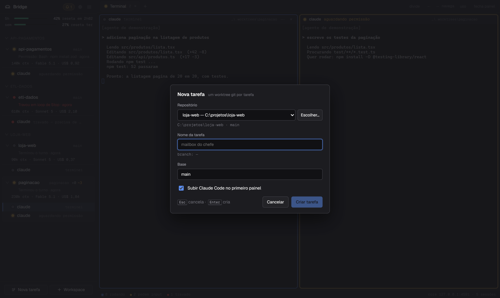
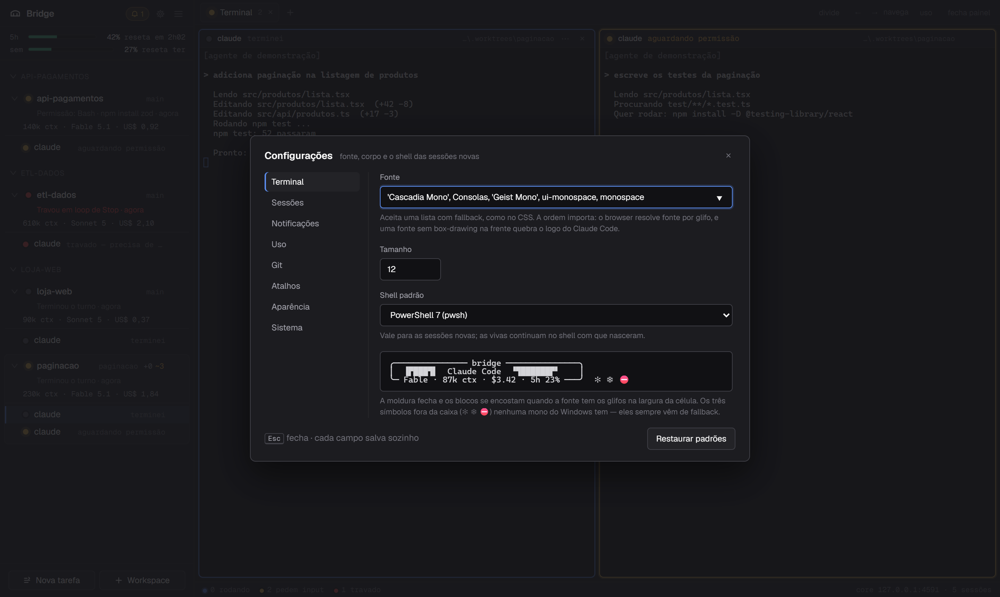
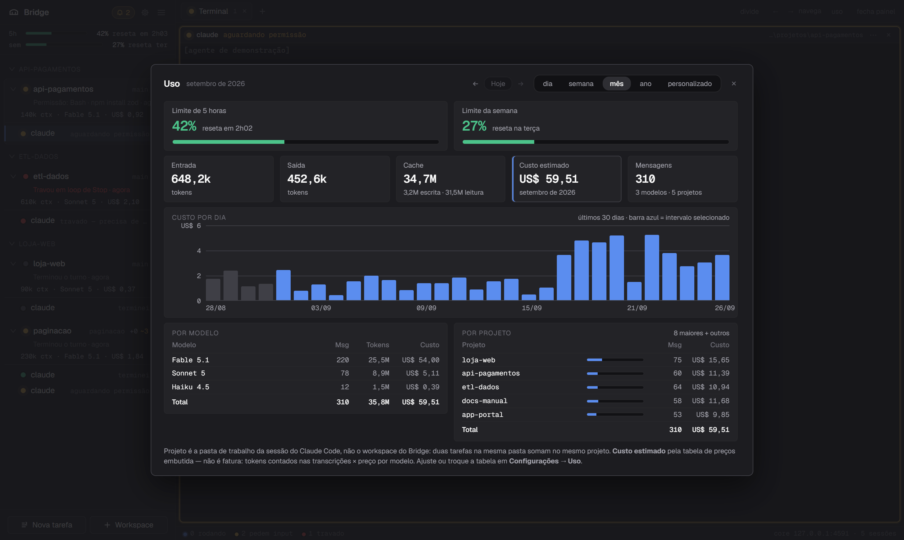

# Bridge

> **Português:** a documentação completa, com todos os detalhes, está em
> [`README.pt-BR.md`](README.pt-BR.md). This page is the English guide: what
> Bridge is and how to run it.
>
> **The app itself speaks English since 0.13.0.** On a machine whose locale is
> not Portuguese it starts in English with nothing to configure; on any machine
> you can pick the language in `Ctrl+,` → **Appearance** → **Language**. See
> [Language](#language) below.

**Bridge is a Windows desktop app for running several coding agents side by
side.** Each Claude Code session lives in its own terminal pane; Bridge reads
that session's hooks and shows, in a sidebar, what every agent is doing right
now — thinking, waiting for permission, done, stuck — and fires a native toast
when one needs you. It is the Windows answer to
[cmux](https://github.com/manaflow-ai/cmux), which is macOS-only.



- Sidebar with per-session state, last notification and the account's live
  limit bars (5 h / weekly), plus a per-session line with context, model and
  cost — all from the payload Claude Code sends to its status line. Every
  workspace is expanded by default; a chevron on the row collapses one, and
  clicking the name only activates it. The same numbers are **not** drawn in
  the Claude Code terminal unless you ask (Settings → Uso).
- A native **usage monitor**: token counts and estimated cost per day, week and
  month, broken down by model and by project, with a dashboard panel
  (`Ctrl+Shift+Y`) and a `bridge usage` command.
- Workspaces with tabs and splits; the layout survives a restart.
- Real Claude Code integration: a per-session `settings.json` where every hook
  and the status line point at a local HTTP shim — no terminal scraping.
- One task = one `git worktree`, with branch, `+N ~M` badges, merge and removal
  from the UI — and a **scope guard** that stops an agent from reading or
  writing outside its own worktree.
- A `bridge` CLI (`list`, `notify`, `send`, `resume`, `usage`) that
  agents can call from inside their own session.
- Reopening the app resumes each pane with `claude --resume <id>` — and since
  0.12.1 that no longer depends on a clean shutdown: a pane whose agent was
  running is marked as resumable the moment the agent starts, so an installer
  that kills the app, a Windows shutdown or a core that just dies all still
  come back as the agent.

Everything is local: the core listens on `127.0.0.1` only, with a per-instance
token. Nothing leaves the machine.

## Screens

These are from the public build running with demo data: the projects are
made up and the "agents" only fire Claude Code's hooks. The UI in them is in
Portuguese.



| Notifications | New task (worktree) | Settings |
|---|---|---|
|  |  |  |

## Requirements

- **Windows 11** (x64). Not tested on Windows 10 or other systems.
- **Node.js 22+ on `PATH`** — the core runs as a separate Node process and the
  installer does not bundle a runtime.
- The agent itself, installed by you: today the tested adapter is **Claude
  Code** (`claude` on `PATH`).
## Install

Download `Bridge Setup <version>.exe` from
[GitHub Releases](https://github.com/dantaserick/bridge/releases) and run it.
Per-user install, no administrator needed; the CLI folder is added to your
`PATH`.

The installer is **not code-signed**, so Windows SmartScreen shows an "unknown
publisher" warning. Click **More info → Run anyway**, or build from source if
you would rather not trust an unsigned binary. Each release publishes the
installer's SHA-256; check it with `Get-FileHash`.

## Build from source

```
git clone https://github.com/dantaserick/bridge
cd bridge
npm install
npm run dist     # installer lands in packages\shell\release\
```

`npm run dev:app` runs the Electron app without packaging. See
[`CONTRIBUTING.md`](CONTRIBUTING.md) for tests, e2e and conventions.

## Main shortcuts

| Shortcut | Action |
| --- | --- |
| `Ctrl+Shift+N` | New workspace |
| `Ctrl+Shift+Alt+N` | New task (creates a `git worktree`) |
| `Ctrl+Shift+T` / `Ctrl+Shift+W` | New tab / close tab |
| `Ctrl+Shift+D` / `Ctrl+Shift+E` | Split the pane vertically / horizontally |
| `Ctrl+Shift+X` | Close the current pane |
| `Ctrl+Shift+C` | Start a Claude Code session in the focused pane |
| `Ctrl+Shift+U` / `Ctrl+Shift+I` | Jump to the oldest unread / open the notifications panel |
| `Ctrl+Shift+Y` | Open the usage panel (tokens, estimated cost, limits) |
| `Alt+←` `Alt+→` `Alt+↑` `Alt+↓` | Move between panes |
| `Ctrl+Shift+[` / `Ctrl+Shift+]` | Previous / next workspace |
| `Ctrl+Shift+S` | Toggle the sidebar |
| `Ctrl+,` | Settings |

### Copy and paste in the terminal

The terminal follows the Windows Terminal / VS Code convention: `Ctrl+V`,
`Ctrl+Shift+V` and `Shift+Insert` paste; `Ctrl+C` **with a selection** copies it
and clears the selection, while `Ctrl+C` **without a selection** stays `^C`
(SIGINT); `Ctrl+Insert` copies. Right-clicking the terminal copies when there is
a selection and pastes when there is not — there is no context menu. Multi-line
pastes arrive as a single input, because `term.paste` brackets them when the
program on the other side enabled mode 2004 (Claude Code does).

`Ctrl+Shift+C` is left alone: it is the app's "start Claude" shortcut, and it can
be rebound (`agent.claude`) if you would rather have it copy. `Ctrl+Alt+V` and
`Ctrl+Alt+C` are left alone too, because on Brazilian (ABNT2) keyboards `AltGr`
arrives as `Ctrl+Alt`.

The settings dialog lists the full, editable key map; it is read from
`%APPDATA%\bridge\keybindings.json`. It also warns when that file holds a
binding that cannot fire — a combination Bridge cannot parse, or two actions on
the same keys. The hints on the right of the tab bar show the action's **name**
(`divide`, `uso`, `fecha painel`), not the key chord — the chord
lives in each button's tooltip and in that settings table, and it is read from
the same map, so rebinding a key updates the tooltip too. The arrows there are
two separate buttons, left and right.

Sidebar rows (group headers, workspaces and sessions) are keyboard controls:
they take Tab focus, activate with `Enter`/`Space`, move with ↑/↓, and carry an
`aria-label` describing state, session count and focus.

## Language

Bridge speaks **Brazilian Portuguese** and **English**, and the choice is a
single one that covers the whole product: the interface, the API error
messages, the notifications Bridge writes, the status line, the launcher queue
texts, the scope guard's refusal (the one the agent reads), the tray, the
native toasts, the Windows dialogs and the `bridge` CLI.

**Where to change it:** `Ctrl+,` → **Appearance** → **Language**, with three
options — *Português (Brasil)*, *English* and *System*. It applies **right
away, without reopening the window**: no save button, no reload, no "restart
the app". The two language names always show in their own language; only
*System* is a phrase and gets translated.

**The default is `System`** (`ui.language: "system"` in `config.json`), and the
rule is short: a locale of `pt`, `pt-…` or `pt_…` (`pt`, `pt-BR`, `pt-PT`,
`pt_BR`) means Portuguese; **anything else** means English. So an English-speaking machine
gets English without touching a setting. The one who resolves `system` is the
**core**, using its own process locale — the UI, the shell and the CLI receive
an already-resolved language, so two parts of the same app never disagree. The
resolved value shows up in `GET /api/config` as **`languageResolved`**
(read-only: to change it, send `ui.language`).

**In the CLI.** `bridge` asks the core, and the core wins. With Bridge
**closed** — `bridge --help`, `bridge --version`, or any command before the
instance is found — the **`BRIDGE_LANG`** variable (`pt-BR` or `en`) decides,
and without it, the machine's locale:

```powershell
$env:BRIDGE_LANG = "en"
bridge --help          # English help, with Bridge closed
```

With Bridge **open**, `BRIDGE_LANG` does not override the app: `bridge list`
comes out in whatever language Bridge is set to. That is deliberate — two
terminals on the same machine should not answer in different languages about
the same core.

**What is not translated**, on purpose: the output of the agents and the shells
(that text belongs to whoever is running in there), the notifications the
*agent* writes (`Notification` with a `message`, and `bridge notify "text"`),
the file logs (`logs\core.log`, `logs\shell.log` stay in pt-BR — they are for
the owner and for support), the NSIS installer, the documentation, and proper
names and identifiers (`Ctrl+Shift+C`, `wsl:Ubuntu`, session and workspace
ids). A notification that is already recorded is **not** rewritten when you
switch languages: it is the record of something that happened, in the language
of that moment. For the same reason the **session detail** in the sidebar
("thinking…", "writing file") stays in the language of the hook that produced
it until the next hook arrives: it is the last observed state, not a phrase
Bridge redraws.

## Usage and limits



Bridge counts your token usage itself, by reading the transcripts Claude Code
already writes under `~/.claude/projects` (or `CLAUDE_CONFIG_DIR`, or
`BRIDGE_CLAUDE_HOME`). Both the main conversation **and the subagents it
spawned** are counted — on the author's machine the subagents are most of a
day's usage, so leaving them out would be wrong by a factor, not by a detail.

Days start at **local midnight**. The cost is an **estimate** from a bundled
list-price table that carries the date it was checked (shown in
Settings → Uso); you can override it per model with `usage.pricing` or point
`usage.pricingFile` at your own JSON. A model that is in no table still counts
its tokens and is simply left out of the cost, with a warning naming it — a
guessed price would look like an answer.

Nothing but counts is stored: token totals, the model id, the working
directory and the day. No message content is ever read into the database. See
[`SECURITY.md`](SECURITY.md).

## The Claude Code you open inside a shell

Until 0.11.x, typing `claude` in a shell pane gave you a Claude Code that
Bridge could not see: no `--settings`, so no hook ever reached the core, and the
sidebar kept saying `shell` while a whole agent worked in there. From **0.12.0**
on it says `claude`.

How it works: every shell Bridge opens is born with a folder of its own at the
front of its `PATH`, holding a `claude` shim that calls the REAL Claude Code
with `--settings <session folder>\settings.json` added — the very same settings
file (hooks and status line) an agent session gets. You type `claude` normally;
your arguments are passed through untouched.

When the first hook arrives, the session becomes a **host**: the sidebar row and
the pane header start showing `claude` with a real state ring, the detail reads
`no shell` when nothing is happening, and notifications, the status line, usage
accounting, the server-limit badge and the scope guard all apply — as in an
agent session. When you leave Claude (`/exit`, `Ctrl+D`) the row goes back to
`shell` and **the shell is still alive**, same pane, same scrollback.

What does not change: the session's `kind` stays `shell` from beginning to end.
It never becomes an agent session — which is why reopening Bridge brings the
pane back as a plain shell, without resuming the conversation. On a pane that **has already
held an agent session**, though, the **"Reabrir com contexto"** button does
reach it: `POST /api/panes/:id/resume` resumes the last `lastAgentSessionId`
that pane saw, and a Claude opened inside the shell records its own there. On a
pane that only ever held a shell the route still answers `422
nothing-to-resume` — there is no `lastAgent`.

A host session **counts** toward `sessions.maxConcurrentAgents` (it is a real
Claude Code taking a slot) but never goes through the launcher queue — Bridge
did not start it, so there is nothing to queue.

Turning it off: `Ctrl+,` → **Sessões** → "Reconhecer o Claude Code aberto dentro
de um shell" (or `PATCH /api/config { "sessions": { "hostedAgents": false } }`).
Toggling it applies to the **next** shell you open; a hosting already under way
finishes normally on its own. On a machine with no `claude` on the `PATH`
nothing of this happens: with no target there is no shim and no `PATH` change.

## Server limit vs. usage limit, and the launcher

Both show up as "limit" in the terminal and they are not the same thing.
Telling them apart is the most common pain of running several Claude Code
sessions side by side, and Bridge separates them everywhere.

| | **Usage** limit | **Server** limit |
| --- | --- | --- |
| Whose it is | yours (the account's 5 h / weekly windows) | Anthropic's shared infrastructure |
| Scales with the plan? | yes | **no** |
| What the terminal says | the window reached 100 % | `Server is temporarily limiting requests (not your usage limit)`, `API Error: 529`, `overloaded_error` |
| How Bridge shows it | a **red** badge in the sidebar, with the reset time | an **orange** ring and a `⏳ servidor` badge on the session row, with the sentence it read in the tooltip |
| How it clears | you wait for the reset | on its own, in seconds to minutes |

**Detection** runs over the PTY output through a 4 KB rolling window per
session (ANSI stripped, case-insensitive), and it demands the whole Claude Code
sentence — or a token that only exists in the API error body. A
`// TODO: handle rate limit` in a diff or an `if (err.status === 529)` in an
open file fires nothing: a false positive here teaches you to ignore the
indicator. The session leaves `server-limited` on the next normal turn (`Stop`
or `UserPromptSubmit`) or after 5 minutes, whichever comes first.

**The launcher** paces new agents, which is the only lever Bridge has over the
cause (a burst of agents starting at once): a ceiling of
`sessions.maxConcurrentAgents` live agents (default `4`; beyond it
`POST /api/sessions` answers `202 { queued: true, position }` and the sidebar
shows "N sessões aguardando slot" with a **Lançar agora** button), 300–900 ms
of jitter between launches in a burst, and a 5 s → 60 s backoff while any
session is `server-limited`. It never kills or pauses a session that is already
running, and `POST /api/panes/:id/resume` and the agent born with a new task
skip the queue: they are one deliberate click on one session. `GET
/api/launcher`, `POST /api/launcher/launch-now`, `DELETE
/api/launcher/pending/:id` and the `launcher.changed` event are the surface;
Settings → Sessões turns the scheduling off.

## When the resume comes back empty

`claude --resume <id>` (and `--continue`) sometimes starts with no error at all
and opens a **new** conversation: the pane lights up, the agent answers, and the
accumulated context simply is not there. You only find out when you ask
something that depends on what had already been said. Bridge is in a privileged
position to see this happen.

**How Bridge notices.** Every Claude Code hook carries the `session_id` the
agent adopted, and `SessionStart` also carries the `source` (`resume`,
`startup`, `clear`, `compact`). When the pane asked for one conversation and the
first `SessionStart` comes back with **another id** — or with a `source` that is
not `resume` — Bridge marks the session as `resumeOutcome: 'fresh'` and the pane
shows a strip:

> A conversa anterior não foi retomada (o Claude abriu uma sessão nova).
> **[Reabrir com contexto]** **[Ignorar]**

("The previous conversation was not resumed (Claude opened a new session)",
with **Reopen with context** and **Ignore**.) If the payload carries neither the
id nor the `source`, there is no verdict and no strip: a false alarm here would
teach you to ignore the warning.

**What "Reabrir com contexto" does.** Bridge reads the old conversation's
transcript (`<claudeHome>/projects/<encoded cwd>/<id>.jsonl`, the same place the
usage monitor reads from) and builds a **deterministic** recap — no model is
called for this:

- your **last prompt** and the agent's **last three text replies**;
- `tool_use`, `tool_result`, subagents and metadata lines are left out;
- each excerpt is truncated at 600 characters and the whole recap at **2,500**;
- everything goes through `sanitizeDisplay` and comes out as a **single line** —
  the text is written into the agent's prompt, and a line break in there would
  be an Enter in the middle of the recap.

Then it writes it into the terminal, with one Enter at the end:

```
Contexto da sessão anterior (resumo automático do Bridge): Último pedido seu: … · Últimas respostas do agente: … — Continue de onde parou.
```

**This is not the context back**, and the strip does not promise that. It is
enough for the new agent to know what you were talking about; the detailed
history stayed in the old transcript.

**Ignorar** dismisses the warning for that session without writing anything. The
mark is per session, not per pane: an empty resume in the same pane half an hour
later warns again.

**Doing it by itself.** In **Settings → Sessões**, the option *"Ao falhar o
resume, injetar o resumo automaticamente"* (`sessions.autoRecap`) makes the
injection happen with no click. It is born **off**: writing into the agent's
prompt is the only thing here that touches your terminal on its own.

**The three "it did not work" answers**, all legitimate:

| answer | what happened |
| --- | --- |
| `no-resume` (422) | this session did not ask to resume any conversation |
| `transcript-not-found` (404) | that conversation's `.jsonl` is no longer on disk |
| `recap-empty` (422) | the transcript exists, but holds only tool calls |

The route is `POST /api/sessions/:id/recap` and it returns `{ "text": "…" }`. It
only builds the recap — the UI is what writes to the PTY, with a `POST
/api/sessions/:id/input`. Which means: **nothing is written into your terminal
without a click of yours** (or without the option above turned on).

## Scope guard between worktrees

Two tasks of the same repository run in `.worktrees/a` and `.worktrees/b`. A
process's `cwd` is a suggestion, not a fence: nothing stops the Claude Code of
task A from opening — and rewriting — a file of B through an absolute path. The
`git worktree` isolation exists for git; for the agent, it did not. The scope
guard is that fence, and it lives where Bridge already was: in the hook.

`PreToolUse` is the only Claude Code hook that accepts a permission decision in
its response. On every tool call Bridge resolves the declared path and, when it
falls outside the session's root, answers with
`hookSpecificOutput.permissionDecision: "deny"` and a reason written for the
agent to read: which fence it hit, the root it is confined to, and the exact
menu entry that lifts it (`Libere em ⋯ → "Permitir acesso fora do worktree"`,
or `…do repositório`) — the agent repeats that sentence to you, so it names a
menu entry that really exists.

- **The root** is the worktree, when the workspace is a task; the **whole
  repository**, when the workspace is the repo itself (opening a repo at its
  root means working on the repo); the workspace's `cwd` when it is not a repo
  at all. A root that vanished from disk turns the guard off for that session
  instead of denying everything.
- **What is judged**: `Read`, `Edit`, `Write`, `MultiEdit`, `NotebookEdit`,
  `Glob`, `Grep` and `LS`, through the `file_path`, `notebook_path` and `path`
  fields of `tool_input`. The `pattern` of `Glob`/`Grep` is a search pattern,
  not a path, and its results are already filtered by `path`.
- **`Bash` is NOT blocked**, on purpose. A shell command declares text, not a
  path, and the real target depends on the `cwd`, the `PATH`, variables and the
  shell itself. Judging paths inside a command string would produce both false
  positives (every `..` in `--exclude=../x`) and false negatives (a
  `powershell -EncodedCommand`), and a guard that is wrong in both directions
  teaches you to switch it off. See [`SECURITY.md`](SECURITY.md).
- **Path resolution**: relative paths resolve against the **session's** `cwd`;
  `.`, `..` and mixed slashes are collapsed; symlinks and junctions are
  unmasked with `realpath` — including for a file that does not exist yet, so
  writing a new file is not blocked. UNC paths and the device namespace
  (`\\?\`, `\\.\`) are always rejected, and a path that cannot be resolved
  counts as outside: the guard is fail-closed.
- **The 🛡 badge**: the denial goes to the agent, which moves on by itself, so
  the session row in the sidebar shows a blue **🛡 N** badge (N = denials in
  that session) whose tooltip lists the last five paths, sanitized. Lifting the
  guard for that workspace **clears the badge** (0.12.2): the fence it describes
  is gone. Restricting again does not bring the number back — it restarts from
  zero on the next denial.
- **Lifting it**: the workspace's "⋯" menu has *"Permitir acesso fora do
  worktree"* / *"…fora do repositório"* (and *"Restringir…"* to put it back),
  which is `PATCH /api/workspaces/:id` with `{ "crossAccess": true }`. It takes
  effect on the very next `PreToolUse` and is persisted. Settings → Sessões has
  the global switch, *"Guarda de escopo entre worktrees"*
  (`sessions.scopeGuard`), **on** by default.
- **Lifting it is total**, not "access to the sibling worktree": with
  `crossAccess` on, that workspace's sessions can read and write **anywhere on
  disk** again — not just the worktree next door, and not just the repository.
  It is the same freedom the agent had in every version before 0.11.0, which is
  why it is per workspace and explicit.

The guard protects against **agent error and hostile repository content**. It is
**not** a barrier against you: whoever controls the terminal can turn it off,
edit `config.json` or run `git` by hand.

## Windows, Git Bash and WSL: the session environment

On Windows, "open Claude Code in the project folder" does not say *where* it
will run. With Git Bash picked as the shell, the terminal lands in a MINGW64: a
`PATH` without the Linux toolchain, a `node` that is not the distro's, and
network paths (`\wsl.localhost\...`) where `/home` should be. Someone
working inside a WSL distro wants the WHOLE session in there — the shell and
the agent — not a Windows agent staring at a mounted folder.

That is why the environment belongs to the **workspace**, not to the global
configuration: the same machine has one repository that only builds on Ubuntu
and another that only runs under `pwsh`.

### What each choice changes

| Environment | Terminal session | Claude Code |
| --- | --- | --- |
| Bridge default | the `shell` from the configuration | Windows |
| `pwsh` / `powershell` / `gitbash` | the chosen shell | **Windows, as always** |
| `wsl:<distro>` | the distro's `$SHELL` | **inside the distro** |

This matters and is not obvious: picking **Git Bash does not move where Claude
Code runs**. The adapter resolves `claude.cmd` from the Windows `PATH` and the
PTY launches it directly, without going through the chosen shell. Only
`wsl:<distro>` moves both.

### Where to choose it

- **New workspace dialog** (`Ctrl+Shift+N`): the "Ambiente" field, listing the
  environments detected on this machine. The default is "Padrão do Bridge
  (shell da configuração)" — the behaviour you always had.
- **The workspace row's "⋯" menu**: the `Ambiente: …` entries. The environment
  in force is marked with `•`, and "Ambiente: padrão do Bridge" undoes the
  choice. A change applies **from the next session on**: the terminal already
  open stays in the shell it started in (killing it would throw away the work
  in there).
- **CLI**: `bridge new --env wsl:Ubuntu`, `bridge new --env gitbash`,
  `bridge new --env padrao`. The flag writes the environment to the workspace
  and only then opens the session; if the session fails to start, the
  environment goes back to what it was.
- **Tasks** (`bridge task new`, "Nova tarefa"): the worktree **inherits** the
  environment from the workspaces of the same repository. `POST /api/tasks`
  accepts `environment` to send it somewhere else.

The workspace row then shows a `wsl:Ubuntu` badge (or `gitbash`, `pwsh`) next
to the branch. It only appears when a choice was made.

### What Bridge detects

`GET /api/environments` answers with `pwsh`, `powershell`, Git Bash (if Git for
Windows' `bash.exe` exists) and **one entry per distro** from `wsl.exe -l -q`.
For each distro, Bridge asks in there:

```
command -v claude; command -v node; \
  [ -e /proc/sys/fs/binfmt_misc/WSLInterop ] || [ -e /proc/sys/fs/binfmt_misc/WSLInterop-late ] \
  && echo __bridge_interop__; echo __bridge_ok__
```

Three answers: does **`claude`** exist? (it decides whether an agent session
starts there), does **`node`** exist? (informational — the hooks do not use it)
and is **interop** on? The last marker (`__bridge_ok__`) is the sentinel saying
the distro came up: without it, a live distro with no `claude` and no `node`
would read as "did not answer". The list is cached for 60 s.

A distro **without `claude`** is still selectable (you may want just a shell in
there), but the workspace row lights up **⚠ sem claude** and an agent session
there is refused with a 422 before a pane is spent. A distro that does not
answer becomes **⚠ ambiente sumiu**.

### How the session starts inside WSL

```
wsl.exe -d <distro> --cd <translated cwd> -- sh -lc 'exec "${SHELL:-/bin/sh}" -l'
wsl.exe -d <distro> --cd <translated cwd> -- sh -lc 'exec claude "$@"' claude --settings <...>
```

Three decisions worth recording:

1. **`--cd` gets the path translated by `wslpath -a`**, not the Windows one.
   Passing an accented path (or a network drive) would work by accident in some
   cases and fail silently in others — exactly the pain. The agent's
   `--settings` also travels as `/mnt/c/...`, even though the FILE itself is
   still written by the core at the Windows path.
2. **The shell is the distro user's `$SHELL`** (bash, zsh, fish), and the agent
   starts through a login shell (`sh -lc`) — the same path the detection walks.
   Without that, the sidebar would say "claude is here" and the launch would
   fail anyway, because `~/.local/bin`/nvm only enter the `PATH` at login.
3. **The hooks run through the WINDOWS Node, by interop.** The generated
   `settings.json` points at the same `bridge-hook.cjs`, and what executes it
   inside the distro is the Windows `node.exe` (`/mnt/c/.../node.exe`, derived
   from `process.execPath` by `wslpath` itself) — **never the distro's `node`,
   even when it has one**.

The reason for item 3 is the only one that matters: the shim has to POST to the
core at `127.0.0.1:<port>`, and **WSL2's loopback is not shared with Windows**
in the default networking mode (NAT) — from inside the distro, `127.0.0.1` is
the distro itself. (Mirrored mode, `networkingMode=mirrored`, would share it,
but it is optional and Bridge cannot depend on a setting that may not exist on
the machine.) Run by `node.exe`, the shim is a Windows process and its
`127.0.0.1` is the host's, always.

Two consequences of that:

- **the shim path travels in Windows form** (`C:\...\bridge-hook.cjs`), and so
  does `BRIDGE_SHIM`: interop passes the argv through untranslated, and a
  `/mnt/c/...` would reach `node.exe` as a non-existent file;
- **it requires interop on** (`/proc/sys/fs/binfmt_misc/WSLInterop`). Turned
  off, Bridge warns in the environment list and in the workspace menu: the
  session does start, but no hook ever arrives and it sits at "ociosa" in the
  sidebar.

`BRIDGE_PORT`, `BRIDGE_TOKEN`, `BRIDGE_SESSION` and `BRIDGE_SHIM` cross the
boundary through `WSLENV` (yours is preserved).

The distro name is validated before it becomes an argument: nothing starting
with `-` gets through. The argv is passed separately (never a shell line), but
`-d --something` would be argument injection into `wsl.exe`'s own parser.

### Known limits of a WSL session

- **The scope guard does not apply to a WSL session** in this version: the
  agent declares POSIX paths (`/mnt/d/...`) while the workspace's allowed root
  is a Windows path, so the "⋯" menu does not even offer "Permitir acesso fora
  do worktree" — there is no fence to lift (`SECURITY.md`, risk 18).
- **The usage monitor and "resume the conversation" do not see WSL sessions**:
  a Claude Code launched through `wsl.exe` writes its transcript to the
  DISTRO's own `~/.claude/projects` while Bridge reads the Windows one — that
  session's cost is missing from the totals and the resume recap comes back
  empty.
- **A login shell that RESETS `PATH` disables the hosted `claude`** (0.12.0):
  the session's shim is put on the `PATH=` of the `exec` line itself, before the
  distro reads `/etc/profile` and `~/.profile`. A profile that APPENDS to
  `$PATH` (the normal case) keeps the shim; one that rewrites `PATH` from
  scratch erases it, and `claude` typed in there goes back to starting without
  Bridge's hooks. The file is still on disk — what was lost is the path to it.
- **An `/etc/wsl.conf` with `metadata` and a restrictive `fmask` disables it
  too** (0.12.0): Bridge writes the wrapper from the Windows side and does
  **not** run `chmod`. On the default DrvFs that is enough — every file shows
  up as `0777` in there — but a distro configured with `options = "metadata"`
  and an `fmask` that strips the execute bit makes the session's `claude`
  answer "Permission denied". The way out is a `chmod +x` on the wrapper, or a
  looser `fmask`.

### Manual verification still pending

The machine this feature was built on **has no WSL distro** (`wsl -l -q` comes
back empty, 06/09/2026). The whole command assembly, the UTF-16LE parsing of
`wsl.exe -l -q`, the `wslpath` translation and the shim path are covered by
tests **against a simulated `wsl.exe`**. What is missing, on a machine with a
distro installed:

1. `GET /api/environments` listing the distro with the right
   `claude`/`node`/`interop`;
2. opening a workspace with `--env wsl:<distro>` and seeing the shell come up
   in `/home`, not in `/mnt/c`, including with a space or an accent in the
   project path;
3. starting Claude Code in that workspace and confirming that **the hooks
   arrive** (the sidebar leaves "ociosa" and the status line shows up) —
   including on a distro **without `node`**, since the shim never uses the node
   in there;
4. checking the warning on a distro with interop turned off.

## Mouse clicks in Claude Code

Claude Code takes clicks — picking an option, switching between agent tabs —
only in its **fullscreen** UI, and Claude itself decides whether to start in it
(version, gradual rollout, `settings.tui`). Bridge has always forwarded the
mouse: a click becomes an SGR sequence in xterm, crosses the WebSocket and
ConPTY and reaches the program byte for byte. What was missing was Claude
asking for it.

Settings → Sessions → **"Mouse clicks in Claude Code"** (`sessions.mouseClicks`,
on by default) fixes both sides: on, every new session starts with
`CLAUDE_CODE_NO_FLICKER=true` (your own value of that variable wins if set) and
the terminal forwards the mouse; off, the session starts with
`CLAUDE_CODE_DISABLE_MOUSE=1` and the terminal ignores any mouse-tracking
request — dragging always selects text, like a terminal without mouse support.
Applies to sessions opened after the change. In the fullscreen UI scrolling
belongs to Claude itself (it keeps a virtual scrollback; the mouse wheel walks
it), not to the terminal. Either way, the modes a program
turned on (mouse, bracketed paste, application cursor keys) now survive a core
reconnection: the terminal snapshots them before redrawing from the scrollback
and reapplies them afterwards.

## Status and license

**0.15.0, pre-release.** It is what the author uses every day, but it is a
recent public build: unsigned installer, no testing on other people's machines.
See [`CHANGELOG.md`](CHANGELOG.md) for what each version shipped. The threat
model, the protections in place, the accepted risks and how to report a flaw
are in [`SECURITY.md`](SECURITY.md). Licensed under [FSL-1.1-MIT](LICENSE): use it, modify it and run it at work freely; just don't offer Bridge (or an equivalent built from it) as a competing commercial product. Each version becomes MIT two years after it is released.
